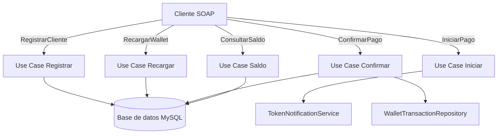

# Wallet SOAP Service

Servicio SOAP para la gestión de una billetera virtual. Implementa casos de uso de registro de clientes, recargas, pagos con token de confirmación y consulta de saldos sobre una base de datos MySQL utilizando TypeORM.

## Flujo general

1. **Registro de cliente**: se persisten datos personales y saldo inicial en la base.
2. **Recarga de billetera**: incrementa el saldo y registra la transacción.
3. **Inicio de pago**: valida saldo, genera sesión y token enviado por correo.
4. **Confirmación de pago**: descuenta saldo, marca sesión confirmada y registra transacción.
5. **Consulta de saldo**: retorna el balance disponible del cliente.

## Diagrama de flujo



## Ejecución en desarrollo

```bash
npm install
npm run dev
```

Se requiere un archivo `.env` con configuraciones de BD y correo (ver `.env.example`) y un servidor MySQL activo.

## Ejecución en producción con Docker

```bash
docker-compose up --build -d
```

El contenedor expone el puerto `4000`. Asegúrate de definir las variables en `.env` antes de construir.

## Pruebas

```bash
npm test
```

Las pruebas incluyen unitarias de casos de uso y de integración para los endpoints SOAP.
